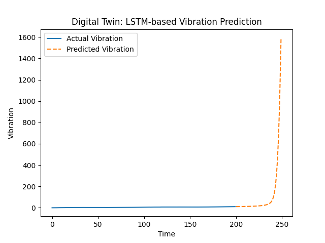
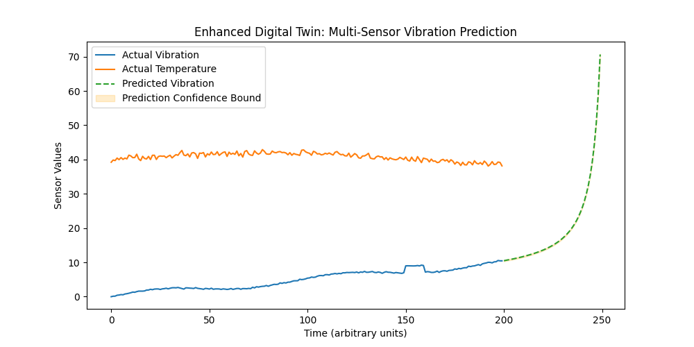

# Digital Twin for Wind Turbine Gearbox Predictive Maintenance

This repository contains Python-based prototypes for a predictive maintenance digital twin, designed for wind turbine gearboxes. The digital twin uses LSTM neural networks to simulate and predict multi-sensor data, identifying operational anomalies and maintenance needs. This work supports research and application in renewable energy system reliability.

## Files Included

- `digital_twin.py`: Basic digital twin prototype using synthetic vibration data and LSTM prediction.
- `enhanced_digital_twin.py`: Advanced digital twin version including multi-sensor simulation (vibration and temperature), anomaly injection, future prediction, and confidence bounds.

## Features

- Simulation of realistic sensor data (vibration, temperature).
- Anomaly/event injection for maintenance scenario testing.
- LSTM-based time series prediction for forecasting sensor values.
- Visualization of actual and predicted trends with error/confidence bounds.

## Usage

1. Clone or download the repository.
2. Install required Python packages: pip install numpy matplotlib tensorflow scikit-learn
3. Run the script in your Python environment, e.g.: python enhanced_digital_twin.py

## Applications

- Predictive maintenance in renewable energy assets.
- Data-driven reliability analysis and operational forecasting.
- Educational demonstration of digital twin concepts and machine learning for energy systems.
- Supports academic research and skill development aligned with renewable energy graduate programs.

---

---
Developed for admission and research alignment with Hochschule Stralsund, Institute of Renewable Energy Systems (IRES).
